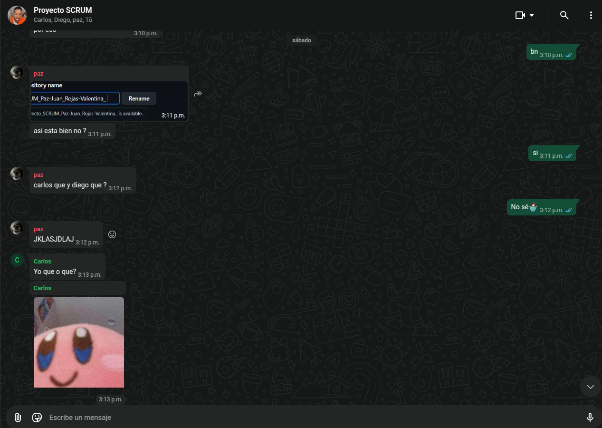
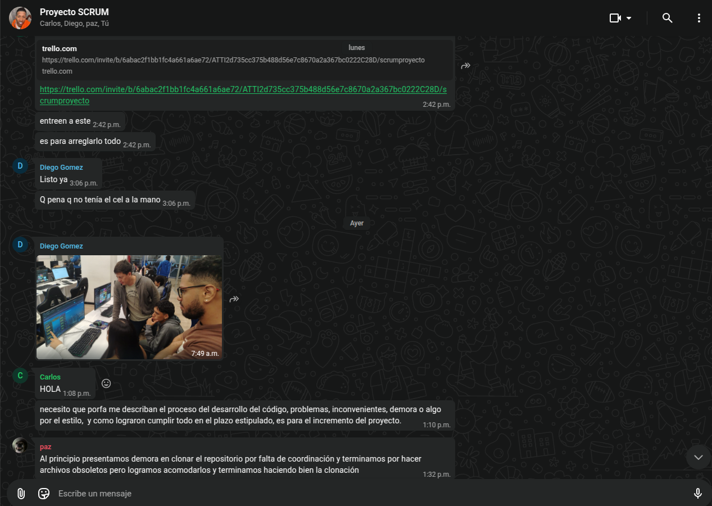
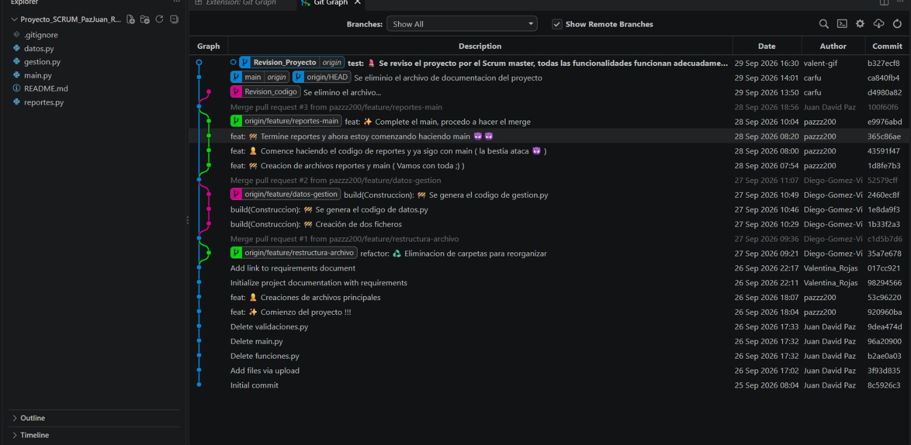
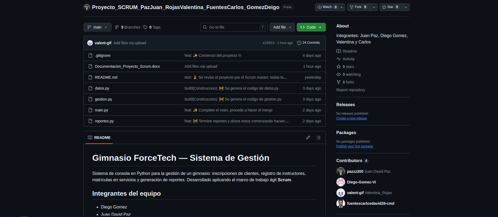

# Gimnasio ForceTech — Sistema de Gestión

Sistema de información para la gestión del **Gimnasio ForceTech**: inscripciones de clientes, servicios, matrículas, seguimiento del progreso y reportes. Desarrollado aplicando el marco de trabajo ágil **SCRUM** con un tablero **Kanban** para el Sprint Backlog.

**CAMPUSLANDS · Grupo Z1 · Floridablanca, Santander · 2026**

---

## Tabla de contenido

1. [Presentación general](#1-presentación-general)
2. [Levantamiento de requerimientos](#2-levantamiento-de-requerimientos)
3. [Requerimientos funcionales y no funcionales](#3-requerimientos-funcionales-y-no-funcionales)
4. [Organización del equipo (roles y tablero)](#4-organización-del-equipo-roles-y-tablero)
5. [Historias de usuario y Product Backlog](#5-historias-de-usuario-y-product-backlog)
6. [Ceremonias SCRUM y trabajo en equipo](#6-ceremonias-scrum-y-trabajo-en-equipo)
7. [Cierre y entrega (código y repositorio)](#7-cierre-y-entrega-código-y-repositorio)

---

## 1. Presentación general

### Situación problema

El Gimnasio ForceTech gestiona hoy sus clientes, servicios e instructores de forma manual o con herramientas dispersas (hojas de cálculo, cuadernos de asistencia y formularios físicos). Esto genera:

- **Sin control centralizado del estado del cliente** (en proceso de inscripción, inscrito, activo o inactivo).
- **Sin control de capacidad** al asignar clientes a servicios (yoga, pilates, entrenamiento personalizado, piscina, gimnasio general), con riesgo de sobrecupo.
- **Progreso sin registro consistente** (asistencia, evaluaciones de condición física, nivel de riesgo).
- **Reportes manuales**, que consumen tiempo administrativo y aumentan la probabilidad de error.

### Solución

Un sistema que centraliza inscripciones, servicios, matrículas y reportes, con acceso diferenciado según el rol del usuario: **Cliente**, **Instructor** y **Administrador**.

### Integrantes y roles SCRUM

| Integrante | Rol SCRUM |
|---|---|
| Carlos Fuentes | Product Owner |
| Valentina Rojas | Scrum Master |
| Juan David Paz | Development Team |
| Diego Gomez | Development Team |

### Tecnologías

- **Lenguaje:** Python 3
- **Paradigma:** programación estructurada / modular, sin librerías externas
- **Control de versiones:** Git y GitHub
- **Gestión del proyecto:** tablero Kanban (Por hacer / En progreso / Hecho)

---

## 2. Levantamiento de requerimientos

Para identificar las necesidades reales del gimnasio se usaron estas técnicas:

- **Entrevistas** con el personal administrativo, para conocer el proceso actual de inscripción, asignación de servicios y manejo del estado de los clientes.
- **Revisión de la documentación** y del formato de definición del proyecto entregado por el gimnasio (módulos, roles y funcionalidades esperadas).
- **Observación del proceso operativo actual** (registro manual de asistencia, control de capacidad de clases, evaluación periódica de condición física) para identificar puntos débiles.
- **Reuniones de análisis** del equipo para traducir las necesidades en requerimientos funcionales y no funcionales, y luego en historias de usuario priorizadas dentro del Product Backlog.

---

## 3. Requerimientos funcionales y no funcionales

### 3.1 Requerimientos funcionales (qué debe hacer el sistema)

| Código | Descripción |
|---|---|
| RF01 | Registrar clientes capturando identificación, nombres, apellidos, dirección y teléfonos (celular y fijo). |
| RF02 | Asignar y actualizar el estado del cliente (En proceso de inscripción, Inscrito, Activo, Inactivo). |
| RF03 | Clasificar al cliente según nivel de riesgo (alto, medio, bajo). |
| RF04 | Registrar y administrar los servicios ofrecidos (yoga, pilates, entrenamiento personalizado, piscina, gimnasio general). |
| RF05 | Controlar la capacidad máxima de cada servicio/clase y evitar que se exceda al asignar clientes. |
| RF06 | Acceso diferenciado según el rol: Cliente, Instructor y Administrador. |
| RF07 | El cliente puede ver su perfil, registrar sus actividades y consultar su progreso. |
| RF08 | El instructor puede dirigir clases/entrenamientos, registrar asistencia y progreso de sus clientes. |
| RF09 | El administrador puede gestionar inscripciones, servicios y la configuración general del sistema. |
| RF10 | Matricular a un cliente en uno o varios servicios, definiendo fecha de inicio, duración e instructor a cargo. |
| RF11 | Registrar la asistencia de los clientes a las clases/entrenamientos. |
| RF12 | Registrar evaluaciones periódicas de condición física. |
| RF13 | Generar un listado de clientes inscritos. |
| RF14 | Generar un listado de servicios ofrecidos junto con su capacidad. |
| RF15 | Generar un listado de instructores activos. |
| RF16 | Generar un listado de clientes con bajo rendimiento o alto riesgo. |
| RF17 | Mostrar el progreso de los clientes en los distintos servicios. |

### 3.2 Requerimientos no funcionales (cómo debe comportarse el sistema)

| Código | Categoría | Descripción |
|---|---|---|
| RNF01 | Usabilidad | Interfaz intuitiva, usable por administradores, instructores y clientes sin capacitación extensa. |
| RNF02 | Seguridad | Control de acceso basado en roles, protegiendo datos personales y de salud. |
| RNF03 | Rendimiento | Consultas (listados, reportes) en tiempo aceptable, incluso con alto volumen de clientes. |
| RNF04 | Disponibilidad | Disponible durante el horario de operación del gimnasio, minimizando caídas. |
| RNF05 | Escalabilidad | Soportar crecimiento en clientes, servicios e instructores sin degradar el rendimiento. |
| RNF06 | Confiabilidad / Integridad de datos | Evitar inconsistencias, como matricular a un cliente en un servicio que ya alcanzó su capacidad. |
| RNF07 | Mantenibilidad | Diseño modular que facilite futuras actualizaciones (nuevos servicios, nuevos reportes). |
| RNF08 | Compatibilidad | Ejecutable en distintos navegadores/dispositivos. |
| RNF09 | Confidencialidad | Información sensible (identificación, nivel de riesgo, datos de salud) manejada conforme a las normas de protección de datos personales. |

> **Diferencia clave:** los requerimientos funcionales describen *qué hace* el sistema (registrar, asignar, reportar); los no funcionales describen *cómo* lo hace (seguridad, rendimiento, usabilidad, etc.).

---

## 4. Organización del equipo (roles y tablero)

### 4.1 Roles SCRUM

| Rol | Integrante | Responsabilidad |
|---|---|---|
| Product Owner | Carlos Fuentes | Prioriza funcionalidades y requisitos del cliente; presenta y prioriza las historias de usuario. |
| Scrum Master | Valentina Rojas | Facilita el proceso, resuelve impedimentos y realiza la revisión y pruebas finales antes de producción. |
| Development Team | Juan David Paz y Diego Gomez | Implementan las tareas del Sprint. |

```
            Product Owner
            (Carlos Fuentes)
                  │
            Scrum Master
           (Valentina Rojas)
                  │
          Development Team
     (Juan David Paz · Diego Gomez)
```




### 4.2 Panel de gestión (Kanban)

El avance se gestionó en un tablero con columnas **Por hacer / En progreso / Hecho**. Las tareas se organizaron por día, con tiempo estimado, desarrollador responsable e importancia. El tablero fue reestructurado el sábado por haber quedado desordenado al inicio, y se actualizó a diario según el avance real.

### 4.3 Sprint Goal

> "Al finalizar el Sprint, el Gimnasio ForceTech contará con un módulo funcional que permita registrar la inscripción de nuevos clientes, gestionar el catálogo de servicios con su capacidad máxima, y matricular clientes en dichos servicios sin exceder el cupo disponible."

---

## 5. Historias de usuario y Product Backlog

El Product Backlog tiene **17 historias de usuario**, priorizadas por el Product Owner en tres niveles: **Alta** (base sin la cual el sistema no opera), **Media** (enriquecen la operación diaria) y **Baja** (consulta y análisis). Cada historia se rastrea a un requerimiento funcional (RF).

### 5.1 Product Backlog priorizado

| Código | Ítem del Product Backlog | Actor | Prioridad |
|---|---|---|---|
| RF01 | Registro de inscripción de cliente | Administrador | Alta |
| RF04 | Gestión del catálogo de servicios | Administrador | Alta |
| RF05 | Control de capacidad máxima por servicio | Administrador | Alta |
| RF10 | Matrícula de cliente en un servicio | Administrador | Alta |
| RF06 | Acceso diferenciado por rol | Sistema | Alta |
| RF09 | Gestión general del sistema | Administrador | Alta |
| RF02 | Actualización del estado del cliente | Administrador | Alta |
| RF03 | Clasificación por nivel de riesgo | Administrador | Media |
| RF07 | Perfil y progreso del cliente | Cliente | Media |
| RF08 | Gestión de clases y progreso | Instructor | Media |
| RF11 | Registro de asistencia | Instructor | Media |
| RF12 | Registro de evaluación de condición física | Instructor | Media |
| RF13 | Reporte de clientes inscritos | Administrador | Baja |
| RF14 | Reporte de servicios y capacidad | Administrador | Baja |
| RF15 | Reporte de instructores activos | Administrador | Baja |
| RF16 | Reporte de clientes en riesgo o bajo rendimiento | Administrador | Baja |
| RF17 | Visualización del progreso por servicio | Cliente / Administrador | Baja |

### 5.2 Detalle de las historias de usuario

#### RF01 — Registro de inscripción de cliente · Alta · Administrador
- **Historia:** Como administrador, quiero registrar clientes capturando identificación, nombres, apellidos, dirección y teléfonos, para mantener un registro completo de cada persona.
- **Funcionalidad:** Crear un registro de cliente con identificación, nombres, apellidos, dirección, celular y fijo, asignando automáticamente el estado inicial "En proceso de inscripción".
- **Criterios de aceptación:**
  1. Exige todos los campos obligatorios.
  2. Valida que la identificación sea única.
  3. Guarda celular y fijo por separado.
- **Restricciones:** Solo el Administrador puede crear nuevas inscripciones.

#### RF02 — Actualización del estado del cliente · Alta · Administrador
- **Historia:** Como administrador, quiero asignar y actualizar el estado del cliente (En proceso, Inscrito, Activo, Inactivo), para reflejar su situación real dentro del gimnasio.
- **Funcionalidad:** Modificar el estado entre los cuatro valores definidos, registrando la fecha del cambio.
- **Criterios de aceptación:**
  1. Asigna "En proceso de inscripción" como estado inicial.
  2. Solo permite los 4 estados definidos.
  3. Registra la fecha del último cambio de estado.
- **Restricciones:** El estado inicial no puede omitirse ni dejarse en blanco al crear el cliente.

#### RF03 — Clasificación por nivel de riesgo · Media · Administrador
- **Historia:** Como administrador, quiero clasificar al cliente según su nivel de riesgo (alto, medio, bajo), para identificar quién requiere mayor seguimiento.
- **Funcionalidad:** Asignar y actualizar el nivel de riesgo en cualquier momento, visible desde el perfil.
- **Criterios de aceptación:**
  1. Solo permite uno de los tres niveles definidos.
  2. Puede actualizarse en cualquier momento.
  3. Se muestra en el perfil del cliente.
- **Restricciones:** Solo Administrador e Instructor pueden modificar el nivel de riesgo.

#### RF04 — Gestión del catálogo de servicios · Alta · Administrador
- **Historia:** Como administrador, quiero registrar y administrar los servicios ofrecidos (yoga, pilates, entrenamiento personalizado, piscina, gimnasio general), para mantener actualizada la oferta.
- **Funcionalidad:** Crear, editar y desactivar servicios, cada uno con nombre y descripción.
- **Criterios de aceptación:**
  1. Permite crear, editar y desactivar servicios.
  2. Cada servicio tiene nombre y descripción.
  3. Solo se listan los servicios activos al matricular.
- **Restricciones:** Solo el Administrador puede crear o desactivar servicios.

#### RF05 — Control de capacidad máxima por servicio · Alta · Administrador
- **Historia:** Como administrador, quiero controlar la capacidad máxima de cada servicio o clase, para evitar que se exceda el cupo al asignar clientes.
- **Funcionalidad:** Definir un cupo máximo por servicio y validarlo automáticamente al matricular.
- **Criterios de aceptación:**
  1. Permite definir el cupo máximo por servicio.
  2. Impide asignar un cliente si el cupo ya está lleno.
  3. Muestra cupos disponibles y ocupados en tiempo real.
- **Restricciones:** No se puede matricular a un cliente en un servicio sin cupo disponible.

#### RF06 — Acceso diferenciado por rol · Alta · Sistema
- **Historia:** Como sistema, debo diferenciar el acceso según el rol del usuario (Cliente, Instructor, Administrador), para que cada uno use solo las funciones que le corresponden.
- **Funcionalidad:** Autenticar al usuario y restringir el acceso a módulos según su rol.
- **Criterios de aceptación:**
  1. Autentica y reconoce el rol al iniciar sesión.
  2. Un cliente no puede acceder a funciones de administrador o instructor.
  3. Cada módulo se restringe según el rol correspondiente.
- **Restricciones:** El rol se asigna al crear el usuario y no puede autoasignarse.

#### RF07 — Perfil y progreso del cliente · Media · Cliente
- **Historia:** Como cliente, quiero ver mi perfil, registrar mis actividades y consultar mi progreso, para hacer seguimiento a mi propio avance.
- **Funcionalidad:** Mostrar información personal, historial de actividades y progreso registrado por los instructores.
- **Criterios de aceptación:**
  1. El cliente solo ve su propia información.
  2. Se muestra el historial de actividades.
  3. Se muestra el progreso registrado por sus instructores.
- **Restricciones:** Un cliente no puede ver el perfil ni el progreso de otros clientes.

#### RF08 — Gestión de clases y progreso · Media · Instructor
- **Historia:** Como instructor, quiero dirigir clases y entrenamientos, registrar asistencia y el progreso de mis clientes, para controlar su participación y evolución.
- **Funcionalidad:** Ver clientes asignados, marcar asistencia y registrar avances de progreso.
- **Criterios de aceptación:**
  1. Ve solo los clientes matriculados en sus servicios.
  2. Puede marcar asistencia por cliente y sesión.
  3. Puede registrar avances de progreso por cliente.
- **Restricciones:** Un instructor no puede modificar clientes de servicios que no dicta.

#### RF09 — Gestión general del sistema · Alta · Administrador
- **Historia:** Como administrador, quiero gestionar inscripciones, servicios y la configuración general del sistema, para mantenerlo operativo.
- **Funcionalidad:** Acceso completo a todos los módulos y configuraciones generales.
- **Criterios de aceptación:**
  1. Tiene acceso a todos los módulos.
  2. Puede modificar configuraciones generales.
  3. Se registra quién hizo cada cambio relevante.
- **Restricciones:** Solo puede existir el rol Administrador con este nivel de acceso.

#### RF10 — Matrícula de cliente en un servicio · Alta · Administrador
- **Historia:** Como administrador, quiero matricular a un cliente en uno o varios servicios definiendo fecha de inicio, duración e instructor a cargo, para formalizar su participación.
- **Funcionalidad:** Seleccionar cliente, servicio, fecha, duración e instructor, validando el cupo antes de confirmar.
- **Criterios de aceptación:**
  1. Permite elegir cliente, servicio, fecha, duración e instructor.
  2. Valida el cupo disponible antes de matricular.
  3. Permite varias matrículas simultáneas por cliente.
- **Restricciones:** El cliente debe existir y tener un estado válido antes de ser matriculado.

#### RF11 — Registro de asistencia · Media · Instructor
- **Historia:** Como instructor, quiero registrar la asistencia de mis clientes, para controlar su participación real en cada sesión.
- **Funcionalidad:** Mostrar los clientes matriculados en la clase del día y marcar presente/ausente.
- **Criterios de aceptación:**
  1. Muestra los clientes matriculados en la clase del día.
  2. Permite marcar presente o ausente por cliente.
  3. Guarda el historial de asistencia por fecha.
- **Restricciones:** Un instructor solo puede registrar asistencia de sus propios servicios.

#### RF12 — Registro de evaluación de condición física · Media · Instructor
- **Historia:** Como instructor, quiero registrar evaluaciones periódicas de condición física, para hacer seguimiento al progreso de mis clientes.
- **Funcionalidad:** Registrar una evaluación asociada a fecha y cliente, consultable en su historial.
- **Criterios de aceptación:**
  1. Registra la evaluación con fecha y datos del cliente.
  2. Guarda el historial de evaluaciones por cliente.
  3. Permite ver la evolución entre evaluaciones.
- **Restricciones:** Solo Instructor y Administrador pueden registrar evaluaciones.

#### RF13 — Reporte de clientes inscritos · Baja · Administrador
- **Historia:** Como administrador, quiero generar un listado de clientes inscritos, para tener visibilidad de quiénes hacen parte del gimnasio.
- **Funcionalidad:** Listado con nombre, identificación y estado.
- **Criterios de aceptación:**
  1. Muestra nombre, identificación y estado.
  2. Permite filtrar por estado.
  3. Puede visualizarse o exportarse.
- **Restricciones:** Solo el Administrador puede generar este reporte.

#### RF14 — Reporte de servicios y capacidad · Baja · Administrador
- **Historia:** Como administrador, quiero generar un listado de servicios con su capacidad, para controlar la oferta y ocupación del gimnasio.
- **Funcionalidad:** Listado con capacidad máxima, cupos ocupados y disponibles por servicio.
- **Criterios de aceptación:**
  1. Muestra capacidad máxima y cupos ocupados.
  2. Identifica servicios con cupo disponible.
  3. Se actualiza en tiempo real.
- **Restricciones:** Solo el Administrador puede generar este reporte.

#### RF15 — Reporte de instructores activos · Baja · Administrador
- **Historia:** Como administrador, quiero generar un listado de instructores activos, para conocer el equipo disponible.
- **Funcionalidad:** Listado de instructores activos con los servicios asignados.
- **Criterios de aceptación:**
  1. Incluye solo instructores activos.
  2. Muestra los servicios asignados a cada uno.
  3. Es consultable en cualquier momento.
- **Restricciones:** Solo el Administrador puede generar este reporte.

#### RF16 — Reporte de clientes en riesgo o bajo rendimiento · Baja · Administrador
- **Historia:** Como administrador, quiero generar un listado de clientes con bajo rendimiento o alto riesgo, para priorizar su atención.
- **Funcionalidad:** Filtrar clientes por nivel de riesgo alto o bajo rendimiento según evaluaciones registradas.
- **Criterios de aceptación:**
  1. Filtra por nivel de riesgo alto.
  2. Identifica bajo rendimiento según evaluaciones.
  3. Muestra el motivo de inclusión de cada cliente.
- **Restricciones:** Solo el Administrador puede generar este reporte.

#### RF17 — Visualización del progreso por servicio · Baja · Cliente / Administrador
- **Historia:** Como administrador (o como cliente sobre sí mismo), quiero visualizar el progreso de los clientes en los distintos servicios, para evaluar su evolución.
- **Funcionalidad:** Mostrar el progreso del cliente en cada servicio, basado en asistencia y evaluaciones.
- **Criterios de aceptación:**
  1. Muestra el progreso por servicio matriculado.
  2. Se basa en asistencia y evaluaciones registradas.
  3. El cliente ve solo su progreso; el administrador ve el de todos.
- **Restricciones:** Un cliente no puede ver el progreso de otros clientes.

---

## 6. Ceremonias SCRUM y trabajo en equipo

### 6.1 Sprint Planning

Reunión inicial donde se definió el Sprint Goal y se seleccionaron las historias del Product Backlog. La facilitó el Scrum Master, el Product Owner presentó y priorizó las historias, y el Development Team las desglosó en tareas.

### 6.2 Daily Stand-up

| Fecha | Avance |
|---|---|
| Viernes 25 de septiembre | Inicio de reuniones, división de roles y tareas de cada integrante. Creación del repositorio en GitHub y del tablero. |
| Sábado 26 de septiembre | Segunda reunión. Paz creó el `.gitignore` y carpetas; el Scrum Master y el Product Owner redactaron los requerimientos funcionales y no funcionales. En la tarde, PO, Scrum Master y equipo definieron la estructura del software. |
| Domingo 27 de septiembre | Diego eliminó las carpetas del sábado (la estructura acordada era distinta) y creó `datos.py` y `gestion.py`, la base del backend. |
| Lunes 28 de septiembre | Paz creó `reportes.py` y `main.py`, terminando la parte de código; se pasó a pruebas. |
| Martes 29 de septiembre | Última reunión. La Scrum Master revisó el código, hizo pruebas y aprobó el producto para producción. |


### 6.3 Sprint Review

Durante el Sprint, el equipo presentó cada día sus avances y el cumplimiento de las tareas del Sprint Backlog. Se creó el repositorio, se definió la estructura del software con el PO y la Scrum Master, se desarrolló el backend (`datos.py`, `gestion.py`) y se completó el código (`reportes.py`, `main.py`). La Scrum Master lo revisó, probó y aprobó para producción.

**Feedback recibido:** mejorar la organización de las tareas dentro de los tiempos estipulados y la coordinación al clonar el repositorio, donde la falta de comunicación generó archivos obsoletos y retrasos.

### 6.4 Sprint Retrospective

- **Lo que salió bien:** se entregó el producto completo y aprobado dentro del Sprint; la reunión del sábado dio una estructura clara; el trabajo se repartió de forma ordenada; el equipo se adaptó al cambio sin afectar la entrega; la Scrum Master cumplió bien la supervisión final.
- **Lo que se puede mejorar:** hubo demora al clonar el repositorio por falta de coordinación, se generaron archivos obsoletos, y las carpetas creadas por Paz antes de la reunión se eliminaron, por lo que ese trabajo se hizo dos veces.
- **Cómo se resolvió:** el equipo acomodó los archivos, eliminó los obsoletos y logró clonar el repositorio correctamente.
- **Acciones para el próximo Sprint:**
  1. Definir la estructura del proyecto antes de crear carpetas o archivos.
  2. Avisar al equipo antes de eliminar o reorganizar archivos.
  3. Hacer `git pull` antes de empezar a trabajar para tener la versión actualizada.
  4. Mantener la revisión final de la Scrum Master antes de pasar a producción.
- **Conclusión:** el Sprint cumplió su objetivo. La comunicación y la coordinación en el manejo del repositorio son tan importantes como el código.

### 6.5 Artefactos SCRUM

- **Product Backlog:** las 17 historias de usuario (sección 5).
- **Sprint Backlog:** subconjunto del Product Backlog comprometido para el Sprint.
- **Incremento:** software desarrollado por etapas: estructura definida el sábado, backend (`datos.py`, `gestion.py`) por Diego, y `reportes.py` y `main.py` por Paz; luego pruebas y aprobación de la Scrum Master, dejando un producto funcional.

---

## 7. Cierre y entrega (código y repositorio)

### Estructura del proyecto

```
├── datos.py        # Estructuras de datos iniciales (almacenamiento en memoria)
├── gestion.py      # Lógica de negocio, validaciones y operaciones CRUD
├── reportes.py     # Generación de reportes en consola
├── main.py         # Punto de entrada y menú principal
└── README.md
```



### Cómo ejecutar

Requiere Python 3. Desde la raíz del proyecto:

```bash
python main.py
```

Menú interactivo:

```
===== GIMNASIO FORCETECH =====
1. Registrar cliente
2. Registrar instructor
3. Inscribir cliente en un servicio
4. Listar clientes
5. Listar instructores
6. Ver reportes
0. Salir
```

### Descripción de los archivos

#### `datos.py` — Estructuras de datos
Almacén central del sistema (base de datos en memoria). Solo contiene variables, sin funciones.

| Variable | Tipo | Descripción |
|---|---|---|
| `servicios_disponibles` | `list[str]` | Servicios fijos: Yoga, Pilates, Entrenamiento Funcional, Piscina |
| `clientes` | `list[dict]` | Clientes registrados |
| `instructores` | `list[dict]` | Instructores registrados |
| `matriculas` | `list[dict]` | Inscripciones cliente–servicio |
| `contador_cliente_id` | `int` | Siguiente ID de cliente |
| `contador_instructor_id` | `int` | Siguiente ID de instructor |
| `contador_matricula_id` | `int` | Siguiente ID de matrícula |

```python
# Cliente
{"id": 1, "nombre": "Diego Gomez", "cedula": "1234567", "edad": 25, "servicios": ["Yoga"]}
# Instructor
{"id": 1, "nombre": "Ana Pérez", "especialidad": "Pilates"}
# Matrícula
{"id": 1, "cliente_id": 1, "servicio": "Yoga"}
```

#### `gestion.py` — Lógica de negocio y validaciones
Depende de `datos.py`. Todas las funciones de registro/inscripción retornan una tupla `(exito: bool, mensaje: str)`.

| Función | Descripción |
|---|---|
| `validar_texto_no_vacio(texto)` | Verifica que el texto no esté vacío ni sea solo espacios |
| `validar_cedula(cedula)` | Verifica que sea numérica y tenga mínimo 6 dígitos |
| `validar_edad(edad)` | Verifica que sea un entero entre 0 y 120 |
| `validar_servicio(servicio)` | Verifica que exista en `servicios_disponibles` |
| `registrar_cliente(nombre, cedula, edad)` | Valida y agrega un cliente |
| `buscar_cliente_por_id(cliente_id)` | Retorna el cliente o `None` |
| `listar_clientes()` | Retorna la lista de clientes |
| `registrar_instructor(nombre, especialidad)` | Valida y agrega un instructor |
| `listar_instructores()` | Retorna la lista de instructores |
| `inscribir_cliente_en_servicio(cliente_id, servicio)` | Valida cliente, servicio y que no esté ya inscrito; crea la matrícula |
| `listar_matriculas()` | Retorna la lista de matrículas |

#### `reportes.py` — Reportes
Lee los datos de `datos.py` (nunca los modifica) y los imprime en consola.

| Función | Descripción |
|---|---|
| `reporte_clientes()` | Clientes con sus servicios inscritos |
| `reporte_instructores()` | Instructores registrados |
| `reporte_inscripciones_por_servicio()` | Clientes inscritos por cada servicio |
| `reporte_general()` | Totales de clientes, instructores y matrículas, con detalle por servicio |

#### `main.py` — Punto de entrada y menú
Depende de `gestion.py`, `reportes.py` y `datos.py`. Incluye `menu_principal()`, `registrar_cliente_menu()`, `registrar_instructor_menu()`, `inscribir_cliente_menu()`, `listar_clientes_menu()`, `listar_instructores_menu()` y `menu_reportes()`. El bloque `if __name__ == "__main__":` ejecuta el menú solo al correr `main.py` directamente.

### Dependencias entre archivos

```
main.py
  ├── gestion.py
  │     └── datos.py
  ├── reportes.py
  │     └── datos.py
  └── datos.py
```

### Flujo típico de uso

1. Registrar instructores (opción 2).
2. Registrar clientes (opción 1).
3. Inscribir un cliente en un servicio con su ID (opción 3).
4. Consultar los reportes (opción 6).

### Trazabilidad: requerimientos vs. código del Sprint

| Requerimiento | Cobertura en el código actual |
|---|---|
| RF01 Registro de clientes | Parcial: nombre, cédula y edad |
| RF04 Catálogo de servicios | Parcial: lista fija de 4 servicios |
| RF10 Matrícula | Parcial: cliente + servicio, sin duplicados |
| RF13 Clientes inscritos | Cubierto: `reporte_clientes()` |
| RF14 Servicios y capacidad | Parcial: inscripciones por servicio, sin cupo máximo |
| RF15 Instructores | Parcial: `reporte_instructores()` |
| RF02, RF03, RF05–RF09, RF11, RF12, RF16, RF17 | Pendiente para próximos Sprints |

### Repositorio y participación

- Repositorio creado el viernes 25 de septiembre en GitHub.
- La rama principal contiene el código fuente y este README con la documentación del proyecto.
- Commits repartidos entre los integrantes del Development Team (Diego Gomez y Juan David Paz), con revisión final de la Scrum Master.



---

## Integrantes

- Juan David Paz
- Diego Gomez
- Carlos Fuentes
- Valentina Rojas
